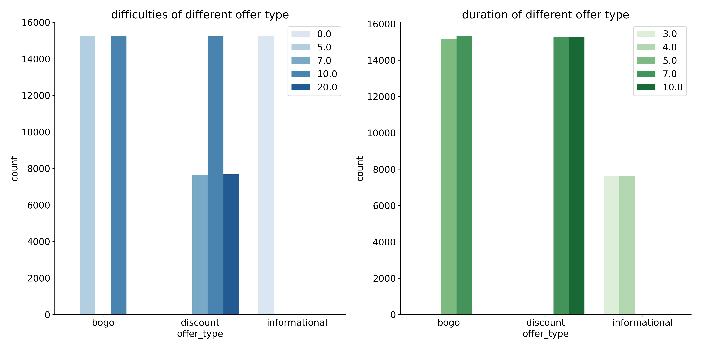

# Starbucks dataset analysis-how can we make more profits

## Introduction

In order to study how people make purchases and how these purchases are influenced by promotional offers. Starbucks performed a test within a duration of one month and recorded customers' behaviors including receiving offers, opening offers and making purchases within the period. I would like to use the [CRISP-DM](https://www.datascience-pm.com/crisp-dm-2/) process to analyse the dataset to shed light on how different customers respond to these offers. In addition, I also create a predictive model to help design a selective promotion strategy which has been proven to reduce the promotion cost.
The whole process can be divided into the following steps:
1. Data cleaning and preprocessing
2. Data transformation and feature engineering: this is the most difficult part of the process, which involves determining which offers were viewed and completed, when they were    viewed.
3. data visualization: comparing the offer completion ratio of different groups of customers.
4. predictive modelling: use machine learning to create a predictive model to help design a selective promotion strategy.

Detailed report on the analysis could be seen [here](https://yzxiao.medium.com/starbucks-promotion-offers-how-do-different-customers-respond-to-them-2f031aba2688)

## Getting started

### Dependencies
data processing: pandas, numpy

visualizations: matplotlib, seaborn

machine learning: seaborn

### Installing 
Clone this repository:
'git clone https://github.com/Yuzhe17/Starbucks-promotion-dataset-analysis.git'

### Executing the program
1. run 'data_preprocessing.py' to create preprocessed dataset
2. run 'create_completion.py' to determine which offers were completed and viewed, when the offers were viewed
3. run 'create_vis.py' to create visualizations including barplots and histogram in order to shed light on how customers respond to different offers.
4. run 'predictive_model.py' to establish a creative model in order to predict who different offers should be sent to.

